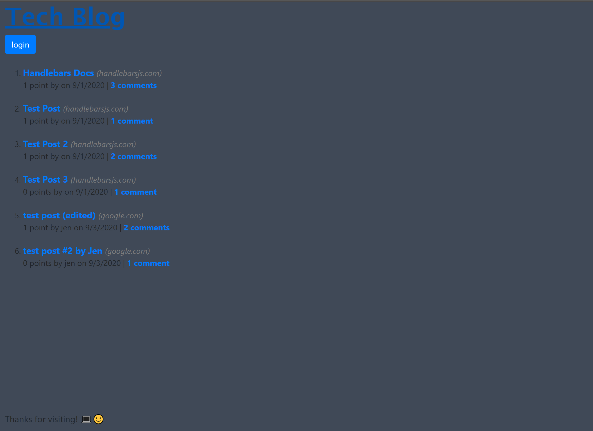

# Tech-Blog


## Description
Tech Blog is a blog website used to showcase Model-View-Controller programming. Its free to sign up! just fill out the sign up form and start posting till your heart is content :) ! 


## Table of Contents
* [Installation](#installation)
* [Usage](#usage)
* [Sample](#sample)
* [License](#license)
* [Questions](#questions)

## Installation
Download the application and run:
```
npm i
npm i sequelize
npm i dotenv
npm install --save mysql2

```

## Usage
1. The app can be accessed at the link below:
https://aqueous-headland-19391.herokuapp.com/


## Sample
Sample scheenshot:



## License
E-commerce backend is licensed under the MIT License.

## Questions
If you have any question please check out my GitHub https://github.com/ortizjavier10 or email me at ortiz.javier10@gmail.com .
